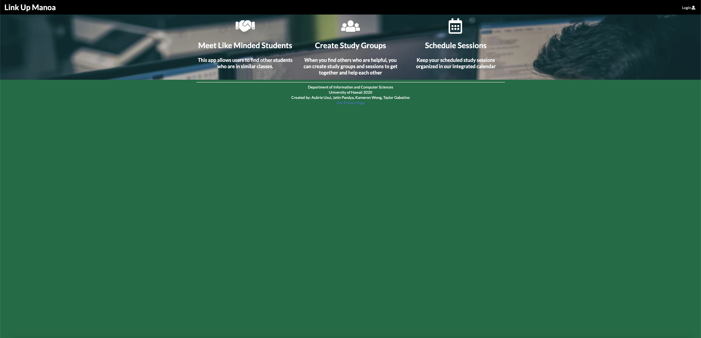
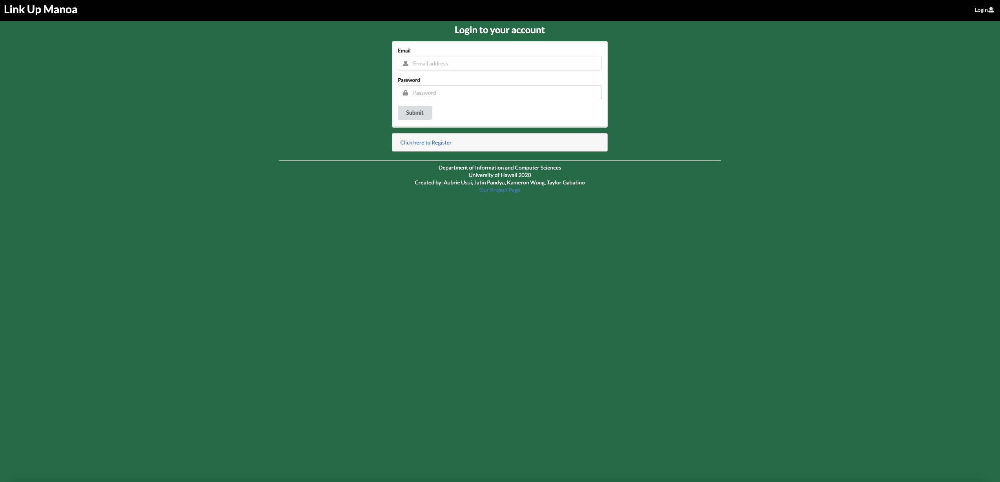
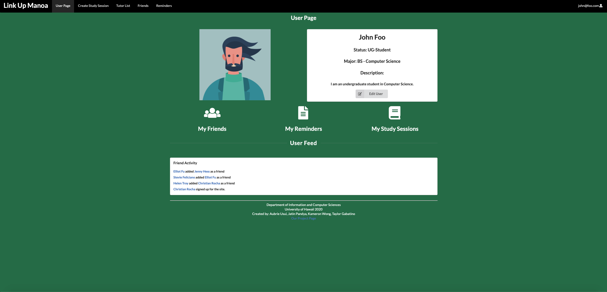
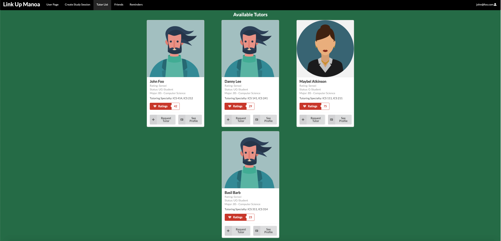
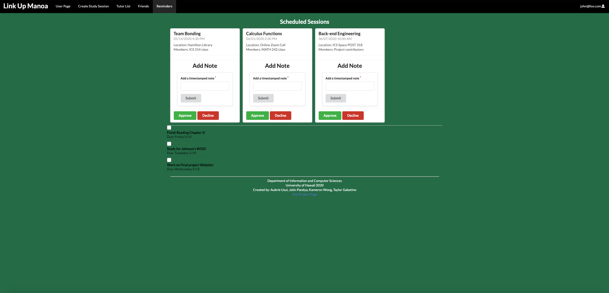
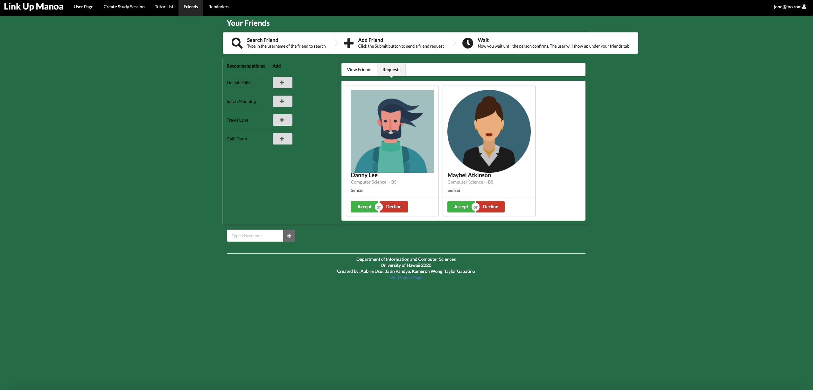
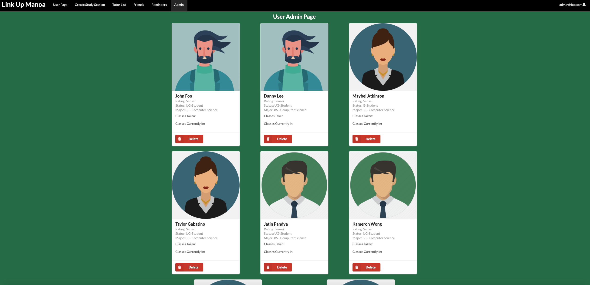

## Link Up Manoa
Link Up Manoa is a web-based platform that was intended to make group-study easier between students. Students have the option of creating an online account that is registered to a database, and can interact between students and other people associated in the same major. Due to classes being large, and social interaction often intimidating between new students and veterans of a University alike, Link-Up-Manoa was created to alleviate the stress associated with finding groups of people to study with, and the space associated with that group.

## Team Contribution and Building

The following are pages that give a general overview of our project, along with my methods of implementing skills 

## Login And User Account Registration

Upon visiting the home page, the top right corner allows users of the site to log in to their respected accounts. Accounts can be of either "user" or "admin" priveleges, and if the person is not a registered user of the site, they are able to become one simply by clicking the "register" button. Once they do, they are redirected to a page that allows them to start off with basic information.

## User Page

Once the user has completed all the basic requirements of creating a profile, or if they are simply logging back into the site, they are then redirected to their user profile page, which contains basic information about themselves and their degree program, along with nav links to certain tools that will help them plan out their studying, organize group meetings, and make friends with those in the same major. As a part of the team, I helped to create the user page UI and functionality.

## Tutor Page

As a user, the student has the potential to become either a student or a student-tutor, where they will provide aid to other students as necessary. Per group contribution, I was in charge of creating the database that housed the tutors, and creating this page that would show users as a list of "cards". Other students have the option of contacting these tutors and requesting help in their subjects of intereest, or creating a group study with the tutors as head of these sessions.

## Sessions Page

The sessions page is connected to the notes section on the user profile page, along with a navbar link that will redirect the user to cards of study groups they have, or notes that they need to complete in order to add to the experience. Users can also add more note cards to keep tabs of assignments they need to complete, and use it as a "journaling" method for reference in group study as well. I contributed to this portion of the project by creating the small database that housed the sessions of the groups.

## Friend Page

The friend page is where users can interact with other members of the site, and add people to study groups accordingly. Similar to social media sites, and based off of this concept, one is able to search and filter for a specific user, or see user recommendations on the side bar and look for a user in that way as well.

## Admin Page

The admin page is for registered users of the site to control the flow of traffic and monitor who is active on the site, and who should be deleted. They also control admin priveleges of user-authentication and group-authentication.

## The Overall Experience

Overall this project allowed me to gain a broader understanding of not only API's and back-end databases, but front-end development and frameworks that can make programming a lot easier. It also taught me more about group-development and teamwork, and how to manage our time efficiently. If there is anything that I could improve on this project, it would be to manage the back end databases in a clean manner, and implement chat-rooms for people to discuss study groups. The user interface could also potentially be cleaner, and have more pictures that depict study group data.

Source:  <a href="https://link-up-manoa.github.io"><i class="large github icon "></i>link-up-manoa/link-up-manoa</a>

